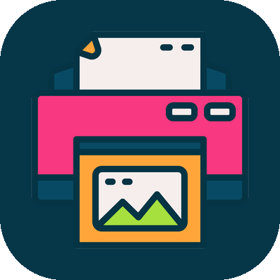

  

<h1 align="center">PrintSpot</h1>

  <b>Find &amp; print at public printers anywhere.</b>

  
  
  
  

---

PrintSpot is a native iOS app for printing photos and documents at public
[Princh](https://princh.com)-enabled printers — the kind found in thousands of
libraries and public spaces worldwide. Instead of hunting for a kiosk web page,
you scan the printer's code (or find one near you on a map), pick your files,
set your options, see the price up front, and send the job for release at the
printer.

It talks directly to the Princh public-printing API, so no account and no
backend of its own are required.

## Features

- **Three ways to pick a printer**
  - Scan the QR/barcode on the printer.
  - Find a printer — a searchable directory of 5,000+ public printers
    worldwide, sorted by distance when you allow location access.
  - Enter the printer ID manually (e.g. `108815`).
- **Saved printers** — keep the ones you use and load them in one tap.
- **Photos & documents** — add from your photo library or the Files app; PDFs,
  images and office files are converted to PDF server-side.
- **Print options** — colour / black &amp; white, copies, two-sided and paper
  size, set per file or for all files at once.
- **Live price estimate** — a running total computed from the printer's own
  price list, updating as you change options; the exact total is confirmed
  before you commit.
- **Order &amp; release** — creates the order, waits for release at the printer,
  and shows your order code.

## How it works

PrintSpot reproduces the flow the official Princh web app uses, calling the
public REST API directly:

    1. POST /auth/v2/oauth/token                  anonymous public-printing token
    2. GET  /rest/v5/devices/{displayId}          resolve printer + capabilities
    3. GET  /rest/v5/connectors/{id}              encryption key id for uploads
    4. POST files.princh.com/v3/files/pdf/        upload each file (-> PDF)
    5. POST /rest/v5/documents                    create a document + print ticket
    6. POST /rest/v5/order-sessions               bundle documents into an order
    7. GET  /rest/v5/order-sessions/{id}/wait     wait for release at the printer

The **Find a printer** directory is loaded from the public
`geo-bridge.princh.com/get-locations` endpoint and cached for the session.

## Building

### Requirements

- macOS with Xcode 16 or newer
- iOS 26.5+ deployment target
- Swift 5

### Quickstart

    git clone https://github.com/AhmedAlBuessa/PrintSpot.git
    cd PrintSpot
    open PrintSpot.xcodeproj

Then select the **PrintSpot** scheme and press Run (⌘R). The app requests
**camera** access to scan printer codes and, optionally, **location** access to
sort nearby printers; both usage descriptions are configured in the target's
build settings.

## Project layout

    PrintSpot/
    ├─ ContentView.swift              Root view — routes between screens
    ├─ PrintSpotApp.swift             App entry point
    ├─ Printing/
    │  ├─ PrinchModels.swift          Codable models for the Princh API
    │  ├─ PrinchAPI.swift             Async API client (actor) + code parser
    │  ├─ PrintFlowModel.swift        Flow orchestrator / observable state
    │  ├─ PrinterDirectory.swift      Global printer directory (find-a-printer)
    │  └─ SavedPrintersStore.swift    Persisted favourites (UserDefaults)
    └─ Views/
       ├─ QRScannerView.swift         AVFoundation QR/barcode scanner
       ├─ PrinterSelectionView.swift  Home screen (scan / find / manual / saved)
       ├─ FindPrinterView.swift       Searchable directory + "near me"
       └─ PrintJobView.swift          Configure → review → send → done

## Privacy

PrintSpot has no backend of its own. It communicates only with the Princh
service to print, uses your location solely on-device to sort nearby printers,
and stores saved printers locally on your device.

## Contributing

Issues and pull requests are welcome. Please keep changes focused and match the
surrounding code style.

## License

This project does not yet declare a license, so all rights are reserved by the
author for now. If you would like to use or build on the code, please open an
issue.

## Disclaimer

PrintSpot is an independent client for the Princh public-printing service and is
not affiliated with, endorsed by, or sponsored by Princh. "Princh" is a
trademark of its respective owner.
